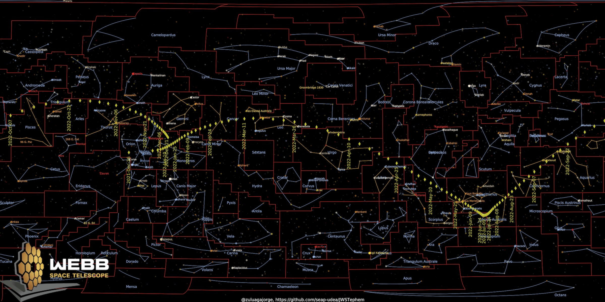

# JWSTephem
Ephemeris of the JWST and data to spot it in the sky
By Jorge I. Zuluaga, U. de A.
----------------------------------

Use this Jupyter notebook to generate the ephemeris and a map of the sky with the location of JWST.

This is an example of the map generated:

## Credit and sources

The code to generate the sky map and the corresponding data, come from the [awesome project](https://github.com/eleanorlutz/western_constellations_atlas_of_space) by Eleanor Lutz.  The actual ephemeris of JWST are obtained from the [Horizons information system of NASA/JPL](https://ssd.jpl.nasa.gov/horizons) and it is retrieved using `astroquery`.

The rest of the code, including bad practices and bugs, are [mine](mailto:jorge.zuluaga@udea.edu.co).
